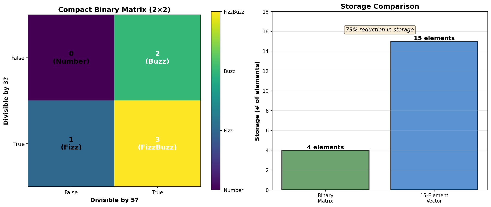
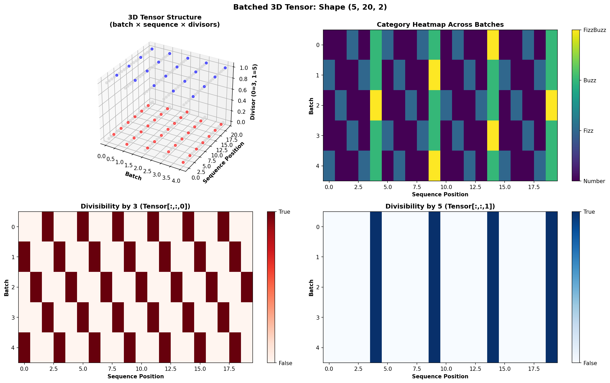

# TensorFizzBuzz 🎵

> *"The most elemental solution to FizzBuzz is not an algorithm, but a number: 15."*

A tensor-based approach to FizzBuzz that reveals its underlying mathematical structure as a periodic signal.

## Three Approaches, Three Problems

This project explores FizzBuzz through three different tensor representations, each optimized for a different use case:

### 1. Pattern Vector (15 elements) - Fast Sequential Access
```python
PATTERN = [0, 0, 1, 0, 2, 1, 0, 0, 1, 2, 0, 1, 0, 0, 3]
category = PATTERN[(n-1) % 15]  # O(1) lookup, 1 modulo operation
```
**Best for:** Sequential iteration, simple indexing
**Visualization:** Signal processing view (waveform, FFT, 2D heatmap)

### 2. Compact Binary Matrix (4 elements) - Minimal Storage
```python
PATTERN_COMPACT = [[0, 2],  # 73% storage reduction
                   [1, 3]]
category = PATTERN_COMPACT[n%3==0][n%5==0]  # 2 modulo operations
```
**Best for:** Memory-constrained environments, embedded systems
**Visualization:** 2×2 heatmap showing binary divisibility structure

### 3. Batched 3D Tensor - Parallel Computation
```python
# Shape: (batch_size, sequence_length, n_divisors)
# Compute multiple sequences simultaneously
result, div_tensor = fizzbuzz_batched(batch_size=10, sequence_length=100)
```
**Best for:** Distributed computing, GPU acceleration, processing multiple ranges
**Visualization:** 3D structure showing parallel batch computation

## Quick Start

```python
from fizzbuzz import fizzbuzz, print_fizzbuzz

# Generate FizzBuzz 1-100
result = fizzbuzz(100)

# Print it
print_fizzbuzz(30)
```

## Visualizations

### Pattern Vector Approach (Signal Processing)


### Compact Binary Matrix Approach (Minimal Storage)


### Batched 3D Tensor Approach (Parallel Computation)


Generate all visualizations:
```bash
python visualize.py           # Pattern vector approach
python visualize_compact.py   # Compact matrix
python visualize_batched.py   # Batched 3D tensor
```

## The Paper

Read the full analysis: [TensorFizzBuzz: A Signal Processing Approach](docs/tensor-fizzbuzz-paper.md)

Topics covered:
- Pattern vector representation (15-element sequential)
- Compact binary matrix (4-element compression)
- Batched 3D tensors (parallel computation)
- Rank-2 divisibility matrices and dimensional compression
- Frequency domain analysis (FFT)
- Trigonometric representations
- Generalization to arbitrary divisors
- Computational complexity analysis

## Generalization

Works for any divisor set! Example with divisors {3, 5, 7}:

```python
from fizzbuzz import create_pattern

pattern, decoder = create_pattern([(3, "Fizz"), (5, "Buzz"), (7, "Bazz")])
# Period = LCM(3,5,7) = 105
# Outputs: "Fizz", "Buzz", "Bazz", "FizzBuzz", "FizzBazz", "BuzzBazz", "FizzBuzzBazz"
```

## Installation

```bash
pip install numpy matplotlib
python fizzbuzz.py
```

## Inspiration

This work was inspired by Susam Pal's elegant ["Fizz Buzz With Cosines"](https://susam.net/fizz-buzz-with-cosines.html), which demonstrated that FizzBuzz can be solved using trigonometric functions. This raised the question: **if FizzBuzz is fundamentally a periodic function, why not represent it as a first-class tensor?**

## License

MIT

## Contributing

This started as a silly exploration - "what if we took FizzBuzz way too seriously?" - and became a genuine investigation into periodic signals and tensor representations. PRs welcome for additional visualizations, optimizations, or generalizations!

---

*Because sometimes the best way to solve a problem is to completely overengineer it.*
