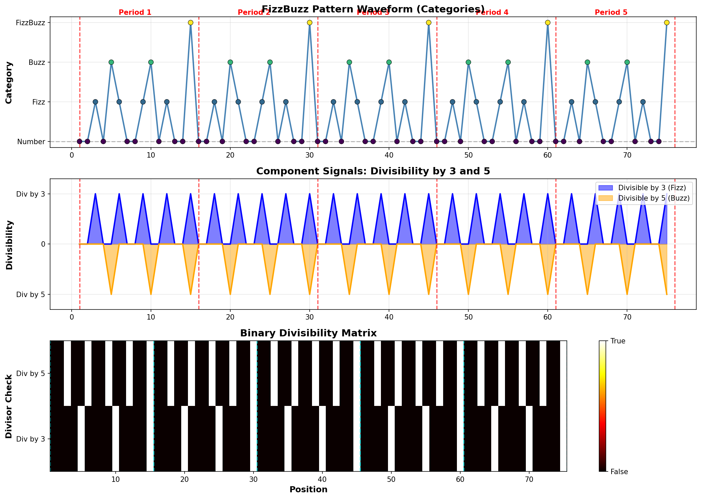
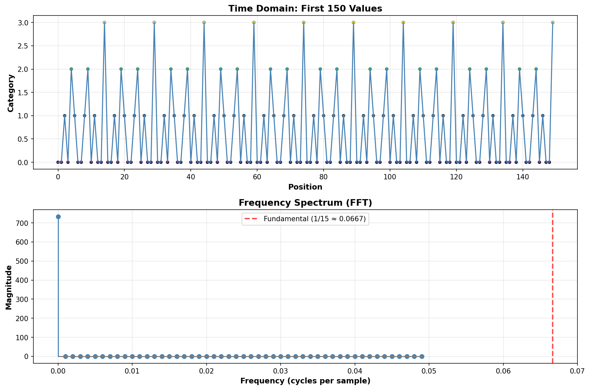
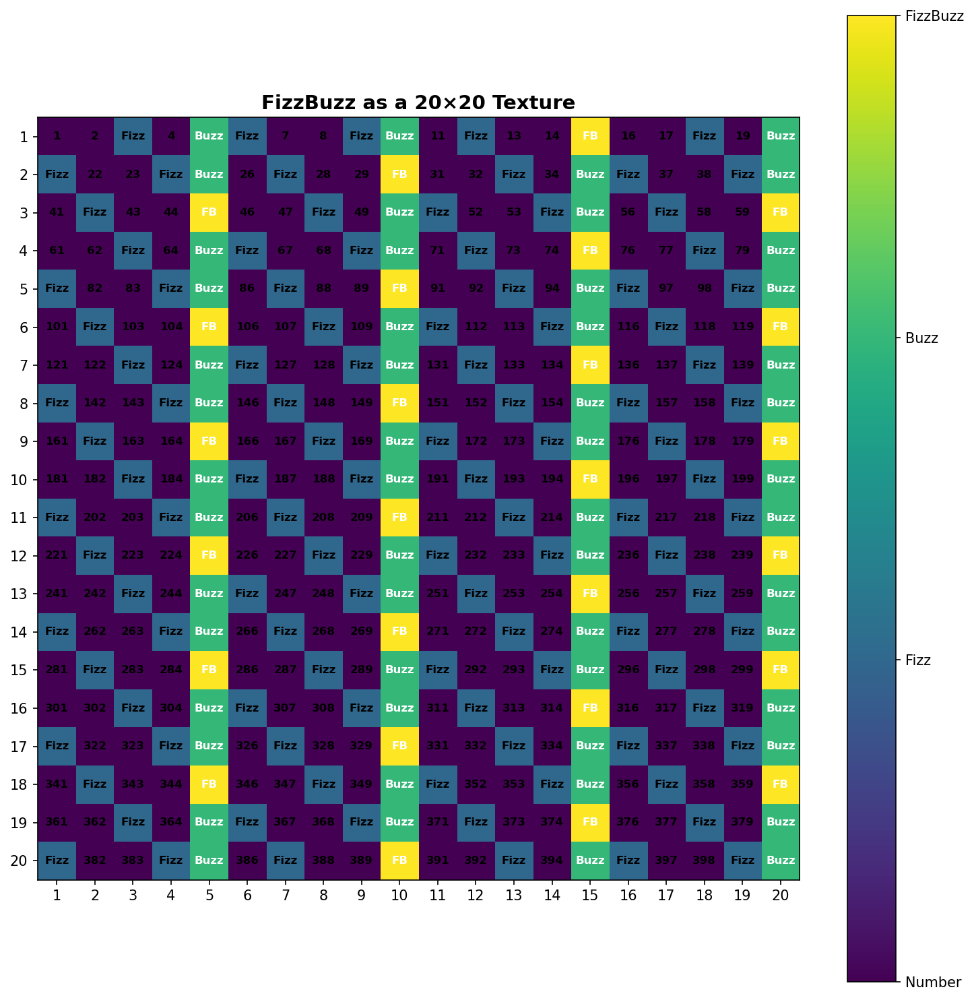

# TensorFizzBuzz 🎵

> *"The most elemental solution to FizzBuzz is not an algorithm, but a number: 15."*

A tensor-based approach to FizzBuzz that reveals its underlying mathematical structure as a periodic signal.

## Overview

Instead of solving FizzBuzz with conditionals, we represent it as a **pattern vector** - a rank-1 tensor of period 15 that encodes the complete solution:

```python
PATTERN = [0, 0, 1, 0, 2, 1, 0, 0, 1, 2, 0, 1, 0, 0, 3]
```

This single vector represents the entire infinite FizzBuzz sequence. Any position `n` maps to the pattern via modular indexing: `PATTERN[(n-1) % 15]`.

## Key Insights

- **Period**: LCM(3, 5) = 15 - the pattern repeats every 15 positions
- **Constant Space**: 15 elements encode infinite sequences
- **O(1) Lookup**: Compute any position instantly via modulo
- **Signal Processing**: FizzBuzz is a discrete periodic signal with fundamental frequency 1/15
- **Vectorized**: Fully parallelizable using NumPy broadcasting

## Quick Start

```python
from fizzbuzz import fizzbuzz, print_fizzbuzz

# Generate FizzBuzz 1-100
result = fizzbuzz(100)

# Print it
print_fizzbuzz(30)
```

## Visualizations

FizzBuzz as a waveform, frequency spectrum, and 2D texture:





Generate visualizations:
```bash
python visualize.py
```

## The Paper

Read the full analysis: [TensorFizzBuzz: A Signal Processing Approach](docs/tensor-fizzbuzz-paper.md)

Topics covered:
- Pattern vector representation
- Rank-2 divisibility matrices and rank-1 compression
- Frequency domain analysis (FFT)
- Trigonometric representations
- Generalization to arbitrary divisors
- Computational complexity analysis

## Generalization

Works for any divisor set! Example with divisors {3, 5, 7}:

```python
from fizzbuzz import create_pattern

pattern, decoder = create_pattern([(3, "Fizz"), (5, "Buzz"), (7, "Bazz")])
# Period = LCM(3,5,7) = 105
# Outputs: "Fizz", "Buzz", "Bazz", "FizzBuzz", "FizzBazz", "BuzzBazz", "FizzBuzzBazz"
```

## Installation

```bash
pip install numpy matplotlib
python fizzbuzz.py
```

## Inspiration

This work was inspired by Susam Pal's elegant ["Fizz Buzz With Cosines"](https://susam.net/fizz-buzz-with-cosines.html), which demonstrated that FizzBuzz can be solved using trigonometric functions. This raised the question: **if FizzBuzz is fundamentally a periodic function, why not represent it as a first-class tensor?**

## License

MIT

## Contributing

This started as a silly exploration - "what if we took FizzBuzz way too seriously?" - and became a genuine investigation into periodic signals and tensor representations. PRs welcome for additional visualizations, optimizations, or generalizations!

---

*Because sometimes the best way to solve a problem is to completely overengineer it.*
